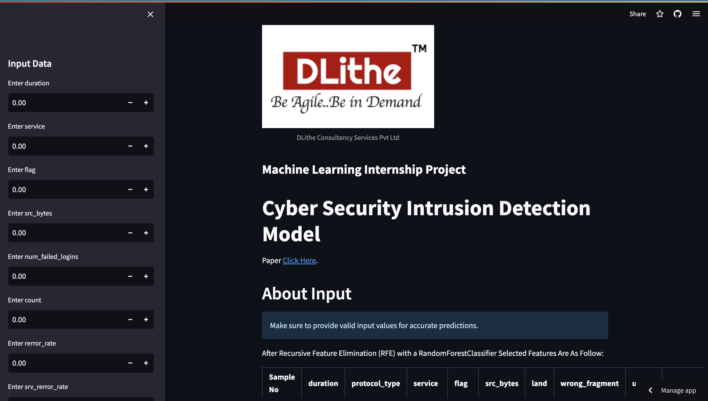
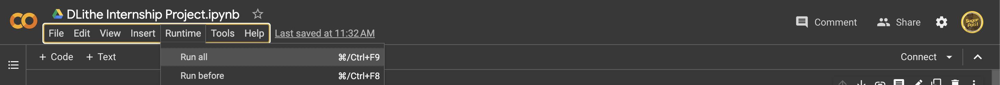

# Cyber Security Intrusion Detection Model

In today's increasingly interconnected world, the need for robust cybersecurity measures is paramount. As cyber threats continue to evolve and grow in sophistication, it is crucial to develop effective intrusion detection systems to safeguard sensitive networks and systems. The objective of this project is to design and implement a robust intrusion detection model using a dataset generated from a simulated military network environment.


## Paper Refered

[IntruDTree: A Machine Learning Based Cyber
Security Intrusion Detection Model](https://drive.google.com/file/d/1qRdfyRDMoeyAPNQ8H_SHT-jIUdV2eH9l/view)

## About Dataset

[@kaggle](https://www.kaggle.com/datasets/sampadab17/network-intrusion-detection)

## Tech Stack

**Language:** Python

**Modules:** Sklearn, Matplotlib, Seaborn etc...

**Platforms** Google colab and Pycharm

**Web Side:** Streamlit


## Screenshots



## Run web page Locally

Clone the project

```bash
  git clone https://github.com/amsagar/Cyber-Security-Intrusion-Detection-Model.git
```

Go to the project directory

```bash
  cd Cyber-Security-Intrusion-Detection-Model
```

Install dependencies

```bash
  pip install -r requirements.txt
```

Start the server

```bash
  streamlit run app.py
```


## To run colab Locally

Clone the project

```bash
  git clone https://github.com/amsagar/Cyber-Security-Intrusion-Detection-Model.git
```

Go to the google colab

```bash
  https://colab.research.google.com/
```

Go runtime and click on run all as shown in image




## Live Demo

https://intrudtre.streamlit.app/


## 🚀 About Me
I'm a django web developer...

Artificial Intelligence And Machine Learning Intern @ DLithe | Pursuing BE in Computer Science


## Badges

[](https://github.com/amsagar/Cyber-Security-Intrusion-Detection-Model/blob/master/LICENSE)


## Support

For support, email sagar.dvg2002@gmail.com

